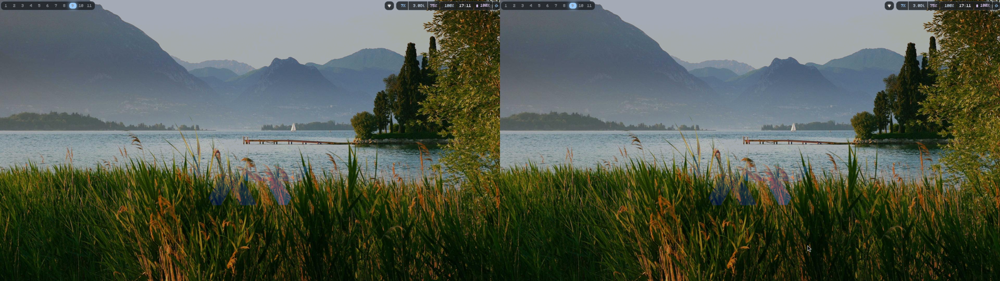
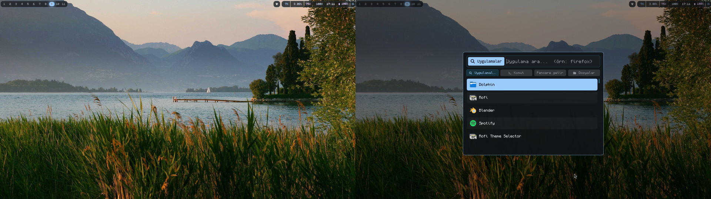
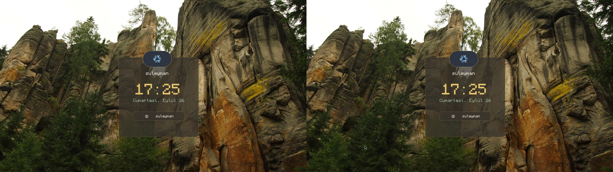

# 🌀 HyperPop Dotfiles

Cam efektli, Minecraft fontlu, duvar kağıdıyla kendini boyayan bir Hyprland kurulumu. `Super+D`'ye basınca arayüz parçaları uçup birleşiyor.

> **Köken:** Bu config, [VicMeGa/Hypr-Dotfiles](https://github.com/VicMeGa/Hypr-Dotfiles) kurulumunun baştan yenilenmiş hâlidir — Lua config, matugen temalama ve özel rofi ile elden geçirildi. Teşekkürler VicMeGa!

## 📸 Ekran görüntüleri





## ✨ Neler var?

- **Hyprland (Lua config)** — 0.56 uyumlu, **0.57 hazır** (legacy `.conf` dönemi bitti, bu repo zaten Lua kullanıyor)
- **Rofi launcher (`Super+D`)** — parçalar uçup birleşen açılış animasyonu (`rofi-fx`, C ile yazıldı), ızgara hap modları, pencereyi bulunduğun alana getiren pencere seçici
- **Matugen temalama** — duvar kağıdı değişince **bar + rofi + açılış animasyonu + kilit ekranı** hep birlikte yeniden boyanıyor (baskın renk algoritmasıyla; turuncu kayık tuzağına düşmez)
- **Waybar** — tek cam şerit, Monocraft font, duvar uyumlu renkler
- **Hyprlock** — Monocraft saat (24 saat), cam kart, duvar uyumlu renkler
- **Duvar kağıtları** — 14 hazır manzara (`wallpapers/`), `Super+W` ile galeriden seç
- **Font** — Monocraft (Minecraft) + Nerd ikon fallback

## 📦 Gereksinimler (Arch/CachyOS)

`hyprland waybar rofi kitty awww matugen jq python-pillow ffmpeg grim slurp brightnessctl playerctl wireplumber nm-applet swaync hyprlock dolphin gtk-layer-shell gcc pkg-config gtk3`

Kurucu eksikleri sorup `pacman` ile kurmayı teklif eder.

## 🚀 Kurulum

```bash
git clone https://github.com/ruhi14532024-a11y/hyperpop-dotfiles.git
cd hyperpop-dotfiles
./install.sh
```

Kurucu şunları yapar:

1. Eksik paketleri sorup kurar
2. Mevcut `~/.config/{hypr,rofi,waybar,matugen,SelectWallpaper}` ayarlarını `~/.config-backup-TARİH` altına yedekler
3. Configleri ve duvar kağıtlarını yerine kopyalar, `/home/suleyman` yollarını senin ev dizinine çevirir
4. Monocraft fontunu indirir, `rofi-fx` animasyon programını derler (olmazsa hazır binary kullanır)
5. İlk duvar kağıdını uygulayıp tüm temaları üretir, ayarları doğrular

Sonra çıkış yapıp tekrar gir (veya `hyprctl reload`).

## ⌨️ Kısayollar (öne çıkanlar)

| Tuş | İş |
|---|---|
| `Super+D` | Uygulama launcher (rofi) |
| `Super+W` | Duvar kağıdı galerisi |
| `Super+L` | Ekranı kilitle |
| `Super+Q` | Terminal |
| `Super+E` | Dosya yöneticisi |
| `Super+1..9` | Çalışma alanları |
| `Super+S` | Scratchpad |
| `Print` | Alan ekran görüntüsü |

## 🗂️ Yapı

```
├── install.sh              # kurucu
├── wallpapers/             # 14 manzara + logolar
├── screenshots/            # ekran görüntüleri
└── config/
    ├── hypr/               # hyprland.lua, hyprlock.conf, Scripts/
    ├── rofi/               # tema, launcher, rofi-fx (C + binary)
    ├── waybar/             # config.jsonc + matugen stilli style.css
    ├── matugen/            # config + şablonlar + wallpaper.sh/lock.sh
    └── SelectWallpaper/    # Super+W galeri scripti
```

Üretilen dosyalar (`matugen.css`, `hyprlock-colors.conf`, `fx-colors`…) repoda yok — kurucu ilk duvarla birlikte üretiyor.

## ↩️ Geri alma

Kurucu eskileri yedekler: `ls ~/.config-backup-*` içinden istediğini geri kopyala. Hyprland tarafında sorun olursa `hyprland.lua`'yı kaldırıp `hyprctl reload` yapman yeterli (eski `.conf` mantığına dönülür).
